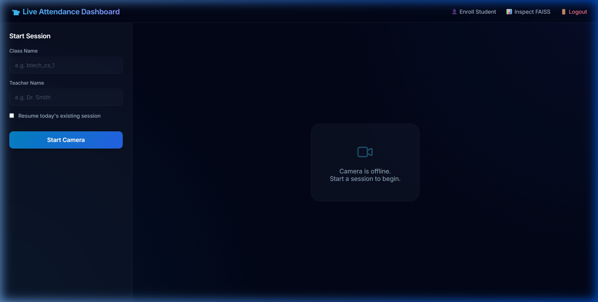
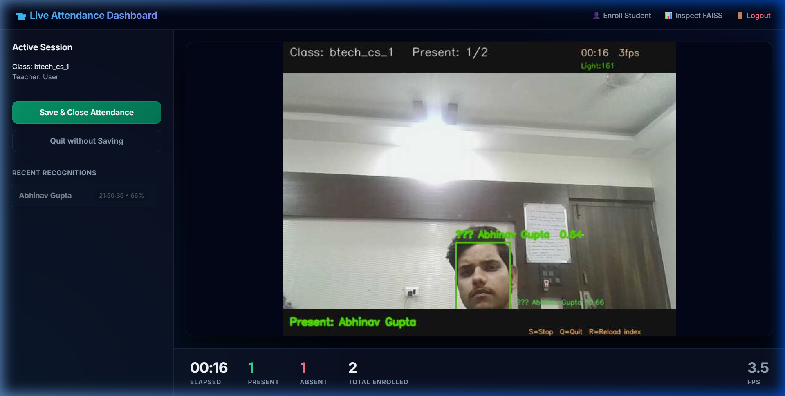
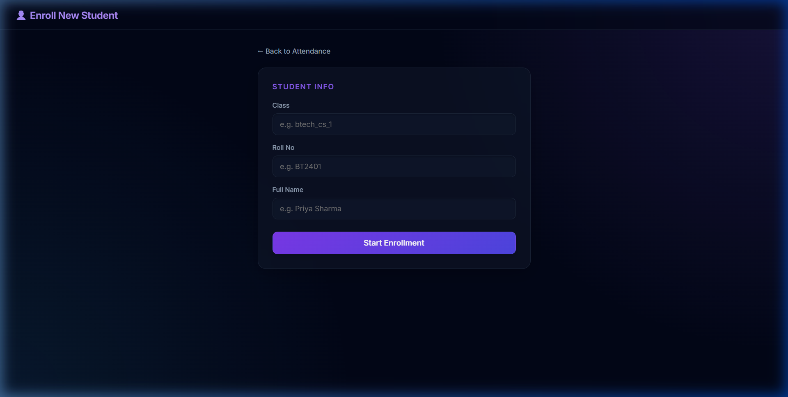
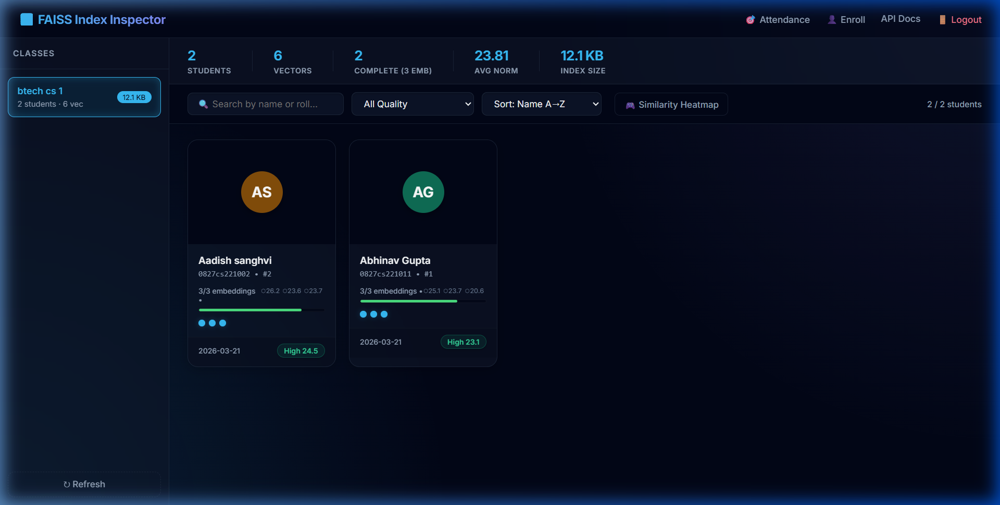
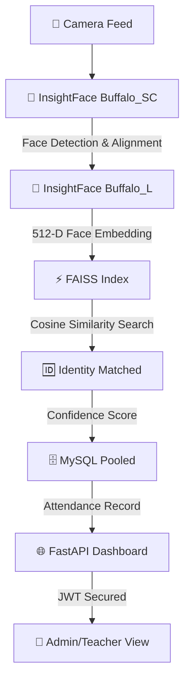

<div align="center">


<p align="center">
  
  
  
  
  
  
  
  
  
</p>

<br/>

> ### 🚀 *"Walk in. Get recognized. Attendance marked. That simple."*
> An intelligent, fully automated attendance system that uses **real-time face detection & recognition** to mark attendance — no ID cards, no roll calls, no nonsense.

<br/>

[](https://forthebadge.com)
[](https://forthebadge.com)
[](https://forthebadge.com)

</div>

---

## ⚡ What Is This?

**FaceAttend AI** is a production-grade, fully automated attendance management system that uses **computer vision + deep learning** to identify people from a live camera feed and record their attendance in real time — with high accuracy, role-based access control, and multi-school support.

No manual entries. No buddy punching. No spreadsheets.

Just walk in front of the camera → recognized → ✅ **Done.**

---

### 🖥️ Live Dashboard

*Real-time attendance tracking with live camera feed and session management.*

### 🛡️ Real-time Recognition

*FaceAttend AI identifying Abhinav Gupta in real-time with confidence scores.*

### 👤 Student Enrollment

*High-precision enrollment system capturing 512-D face embeddings.*

### 🔍 FAISS Index Inspector

*Advanced vector database management for lightning-fast search.*

---

## 🧠 How It Works (Actual Pipeline)



---

## 🔥 Features

| Feature | Status |
|---|---|
| 🎯 Real-time face detection via InsightFace Buffalo_SC | ✅ Live |
| 🧬 512-D face embedding via InsightFace Buffalo_sc | ✅ Live |
| ⚡ FAISS cosine similarity search (per-school index) | ✅ Live |
| 🏫 Multi-school architecture with isolated FAISS indexes | ✅ Live |
| 🗄️ MySQL with connection pooling (pool size 5) | ✅ Live |
| 🔐 JWT authentication (bcrypt + jose) | ✅ Live |
| 👤 Admin & Teacher roles with class-level access control | ✅ Live |
| 📋 Session-based attendance (one session per class/date) | ✅ Live |
| 📸 Student enrollment via webcam (3-angle embeddings) | ✅ Live |
| 🔍 FAISS index inspector UI | ✅ Live |
| 🌐 FastAPI REST API + HTML frontend dashboard | ✅ Live |
| 📊 Analytics & attendance reports | 🔄 In Progress |
| 🚫 Anti-spoofing / liveness detection | 🔄 In Progress |
| 📱 Mobile-friendly UI | 🔄 In Progress |
| 🔔 Email/SMS alerts on absence | 🧪 Planned |
| ☁️ Docker + cloud deployment | 🧪 Planned |

---

## 🏗️ Project Structure

```
AI-powered-attendance-management-system/
│
├── 📁 frontend/                  # HTML/CSS/JS Web Dashboard
├── 📁 models/                    # InsightFace model weights
├── 📁 docs/                      # Project documentation and assets
│   └── 📁 images/                # Screenshots for README
│
├── 📁 scripts/
│   ├── api.py                    # FastAPI entry point
│   ├── auth_deps.py              # JWT auth dependencies
│   ├── db.py                     # MySQL connection pooling
│   ├── live_attendance.py        # Core Recognition logic
│   ├── Enroll_student.py         # Enrollment pipeline
│   ├── inspect_index.py          # FAISS inspection
│   └── routers/                  # API endpoints
│
├── 📁 faiss_indexes/             # Isolated vector indexes
├── 📄 requirements.txt           # Dependency manifest
└── 📄 README.md                  # Project documentation
```

---

## 🛠️ Tech Stack

| Layer | Technology |
|---|---|
| **Face Detection** | InsightFace Buffalo_SC (ONNX) |
| **Face Recognition** | InsightFace Buffalo_L (512-D) |
| **Vector Search** | FAISS (Cosine Similarity) |
| **Backend** | FastAPI + Uvicorn (ASGI) |
| **Auth** | JWT + bcrypt |
| **Database** | MySQL (Connection Pooling) |
| **Frontend** | Vanilla JS, CSS3, HTML5 |

---

## 🚀 Getting Started

### Prerequisites

- Python 3.10+
- MySQL Server (Port 3306)
- Webcam / IP Camera

### Installation

```bash
# 1. Clone the repo
git clone https://github.com/Abhinav-gupta-123/AI-powered-attendance-management-system-.git
cd AI-powered-attendance-management-system-

# 2. Setup Virtual Environment
python -m venv venv
# Windows: venv\Scripts\activate | Linux: source venv/bin/activate
venv\Scripts\activate

# 3. Install Dependencies
pip install -r requirements.txt
```

### Database Initialization

```bash
python scripts/DB_setup.py      # Initialize Schema
python scripts/migrate_auth.py  # Seed Admin Account
# Default login: admin | admin123
```

### Run the Server

```bash
uvicorn scripts.api:app --host 0.0.0.0 --port 8000 --reload
```

---

## ⚠️ Work In Progress

- Anti-spoofing is actively being developed
- GPU support is architecturally ready
- UI redesign is planned

> This is a **living system** — it gets better every week. 🔥

---

<div align="center">

**Abhinav Gupta**

[](https://github.com/Abhinav-gupta-123)


### ⭐ If this project impressed you, drop a star!

*Built with 💜 by Abhinav Gupta | Always improving, never stopping.*

</div>
